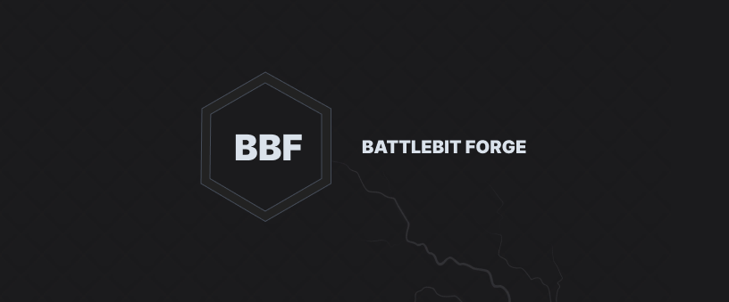
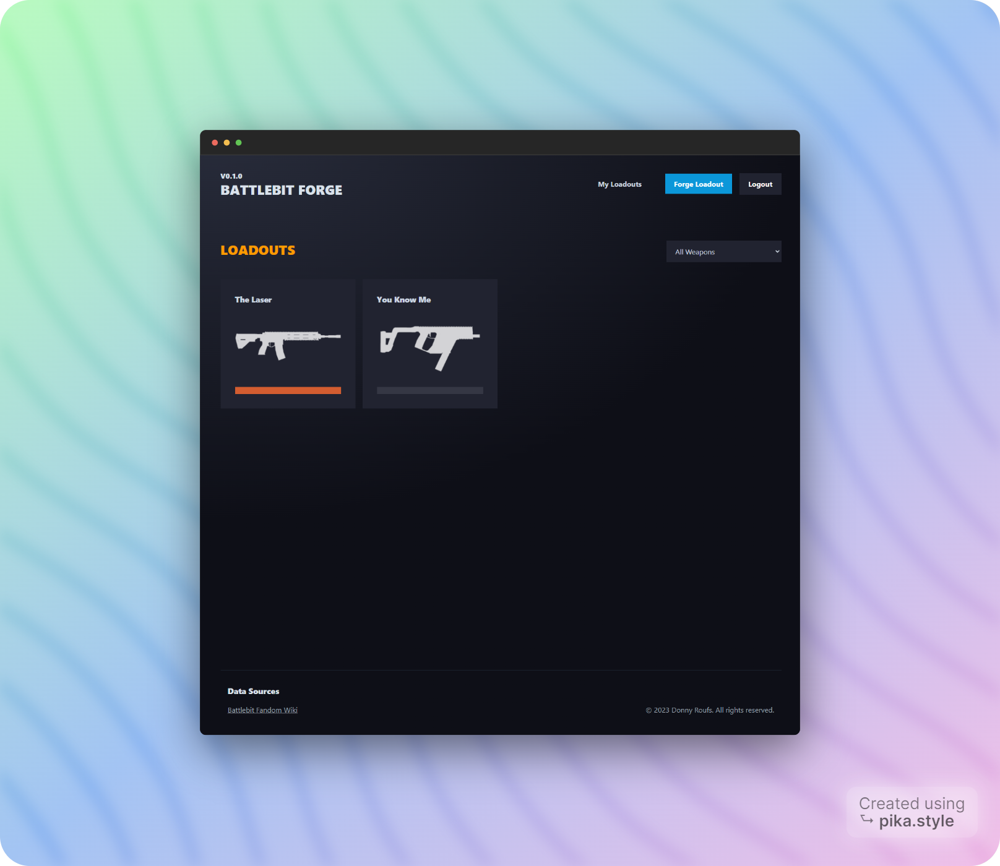
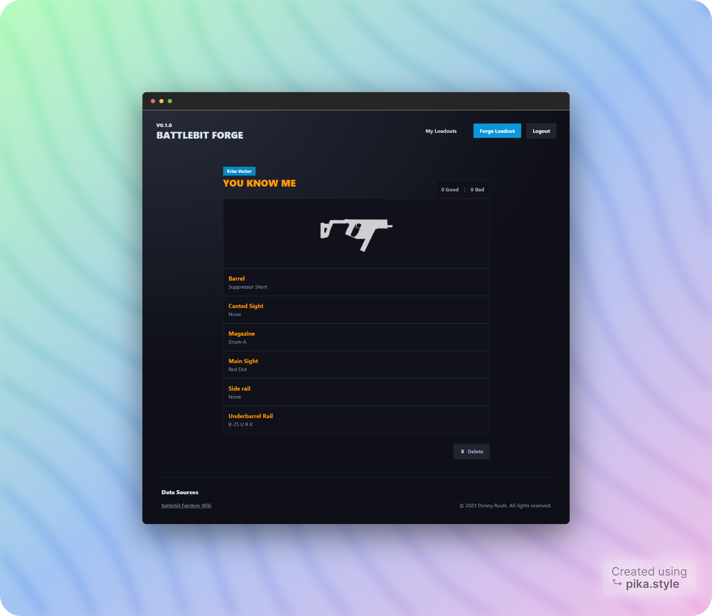

<p align="center">
  
</p>

Forge and showcase your preferred loadouts for others to view and vote on. Effortlessly access analytics on top-performing weapons, attachments, and more.

## How to get started

> Make sure you have docker and docker-compose installed

1. Create .env and copy paste .env.example contents
2. Create oauth credentials for Discord so that you can login =D
3. Run the app with `make app` or `./run.sh`. You can also paste the contents below.

```bash
docker-compose up -d; \
sleep 3; \
yarn prisma migrate dev; \
yarn db:seed; \
yarn dev
```

### Architecture

A few rules:

- Group by feature. A feature could be loadouts, auth, analytics
- Each feature, groups it's use cases in a folder. Whatever you do in that folder is up to you.

```
📁 loadouts
  📁 view-loadout
```

- Try to leave logic out of apps/web
- Create design system components when they can be generic
- Prefer duplication over DRY unless you are certain.

That's it.

<p align="center">
  
  
</p>
